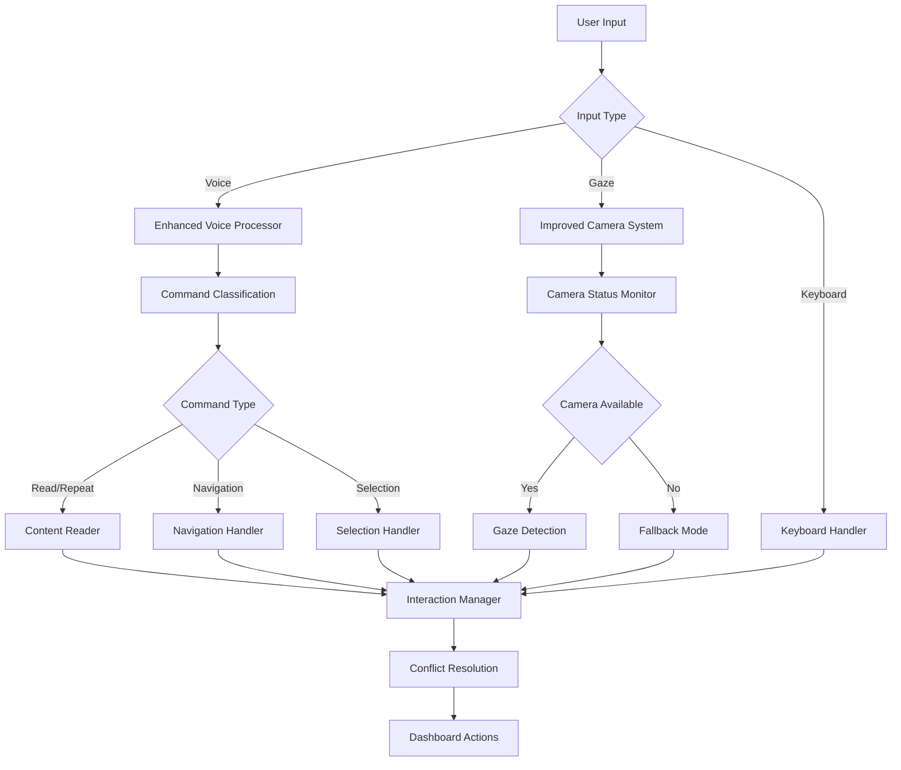

# Design Document

## Overview

This design addresses two critical issues in the adaptive learning platform:
1. Camera initialization failure preventing gaze detection
2. Voice command misinterpretation causing "read aloud" to trigger navigation

The solution involves improving camera initialization logic, enhancing voice command processing accuracy, and implementing better interaction conflict resolution.

## Architecture

### Current Issues Analysis

**Camera Initialization Problem:**
- The system requires HTTPS for camera access but defaults to HTTP in development
- Camera initialization fails silently and falls back to mouse simulation
- No clear user feedback about camera status or troubleshooting steps

**Voice Command Processing Problem:**
- The voice command processor has overly broad pattern matching
- "read aloud" commands are being interpreted as navigation commands
- Lack of context awareness when processing voice commands after navigation

### Proposed Solution Architecture



## Components and Interfaces

### 1. Enhanced Camera System

**CameraManager Interface:**
```typescript
interface CameraManager {
  initialize(): Promise<CameraInitResult>;
  getStatus(): CameraStatus;
  requestPermissions(): Promise<boolean>;
  showTroubleshootingGuide(): void;
  destroy(): void;
}

interface CameraInitResult {
  success: boolean;
  error?: string;
  fallbackMode: boolean;
  troubleshootingSteps?: string[];
}

interface CameraStatus {
  isActive: boolean;
  hasPermission: boolean;
  isHTTPS: boolean;
  errorMessage?: string;
}
```

**Key Improvements:**
- Proactive HTTPS detection with user guidance
- Clear permission request flow with fallback options
- Visual status indicators for camera state
- Detailed error reporting and troubleshooting

### 2. Enhanced Voice Command Processor

**VoiceCommandClassifier Interface:**
```typescript
interface VoiceCommandClassifier {
  classifyCommand(input: string): CommandClassification;
  getConfidenceThreshold(): number;
  setContextualHints(context: InteractionContext): void;
}

interface CommandClassification {
  action: VoiceAction;
  confidence: number;
  originalInput: string;
  matchedPattern: string;
}

interface InteractionContext {
  lastAction?: string;
  currentContent?: string;
  navigationState: NavigationState;
  timesinceLastAction: number;
}
```

**Command Processing Logic:**
1. **Exact Match Priority:** Direct command matches get highest confidence
2. **Context Awareness:** Recent navigation affects command interpretation
3. **Disambiguation:** Clear separation between content and navigation commands
4. **Feedback Loop:** Visual/audio confirmation of interpreted commands

### 3. Improved Interaction Manager

**Conflict Resolution Strategy:**
- Voice commands have highest priority (confidence > 0.7)
- Gaze actions ignored for 1.5 seconds after voice commands
- Context-aware command interpretation based on recent actions
- Clear user feedback for all interpreted actions

## Data Models

### Camera Configuration
```typescript
interface CameraConfig {
  preferredResolution: { width: number; height: number };
  fallbackToMouse: boolean;
  showVisualFeedback: boolean;
  troubleshootingEnabled: boolean;
}
```

### Voice Command Patterns
```typescript
interface VoicePattern {
  pattern: string | RegExp;
  action: VoiceAction;
  priority: number;
  contextRequired?: string[];
  aliases: string[];
}
```

### Interaction State
```typescript
interface InteractionState {
  lastVoiceCommand?: {
    command: string;
    timestamp: number;
    action: string;
  };
  lastGazeAction?: {
    zone: string;
    timestamp: number;
  };
  currentContext: InteractionContext;
  conflictResolutionActive: boolean;
}
```

## Error Handling

### Camera Initialization Errors
1. **HTTPS Required:** Show clear instructions for enabling HTTPS in development
2. **Permission Denied:** Provide alternative input methods with clear explanation
3. **Hardware Unavailable:** Graceful fallback with user notification
4. **Browser Compatibility:** Feature detection with appropriate messaging

### Voice Command Errors
1. **Ambiguous Commands:** Request clarification or choose most likely action
2. **Low Confidence:** Ignore or request repeat with visual feedback
3. **Context Conflicts:** Use recent interaction history to disambiguate
4. **API Failures:** Fallback to keyboard shortcuts with user notification

### Interaction Conflicts
1. **Simultaneous Inputs:** Prioritize based on confidence and recency
2. **Rapid Commands:** Debounce and merge related actions
3. **State Inconsistencies:** Reset to known good state with user notification

## Testing Strategy

### Camera System Testing
1. **Unit Tests:** Camera initialization logic, error handling, fallback behavior
2. **Integration Tests:** Camera + gaze detection pipeline
3. **Manual Tests:** Different browsers, HTTPS/HTTP scenarios, permission states
4. **Accessibility Tests:** Screen reader compatibility, keyboard alternatives

### Voice Command Testing
1. **Unit Tests:** Command classification accuracy, context handling
2. **Integration Tests:** Voice + navigation flow, conflict resolution
3. **Manual Tests:** Various voice inputs, accent variations, noise conditions
4. **User Tests:** Real users with different speech patterns and needs

### Interaction Manager Testing
1. **Unit Tests:** Conflict resolution logic, priority handling
2. **Integration Tests:** Multi-modal input scenarios
3. **Performance Tests:** Response time under various input combinations
4. **Stress Tests:** Rapid input sequences, edge cases

## Implementation Phases

### Phase 1: Camera System Enhancement
- Improve camera initialization with better error handling
- Add visual status indicators and troubleshooting guidance
- Implement graceful fallback with clear user communication

### Phase 2: Voice Command Processing
- Enhance command classification with context awareness
- Implement strict separation between content and navigation commands
- Add visual/audio feedback for all voice actions

### Phase 3: Interaction Conflict Resolution
- Implement priority-based conflict resolution
- Add context-aware command interpretation
- Enhance user feedback and state management

### Phase 4: Testing and Refinement
- Comprehensive testing across all input methods
- User testing with target accessibility users
- Performance optimization and edge case handling